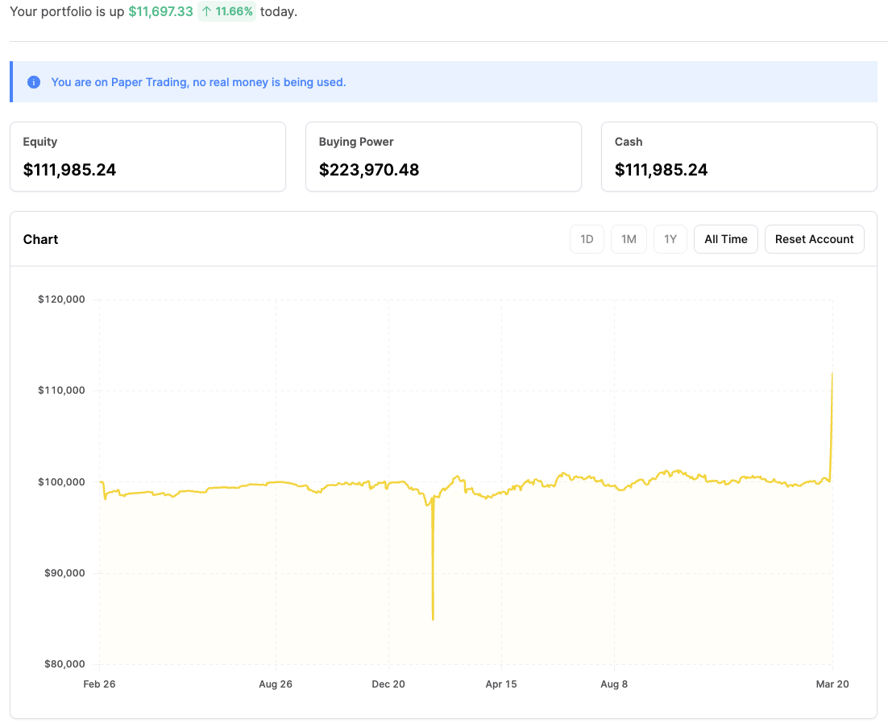

# rbot

This is a dummy algo trading robot I made to play with Alpaca's paper trading account.

## Attention: DO NOT USE THIS WITH REAL MONEY.

This bot will lose money because the logic is flawed, I am an amatuer and did this for the lols. Algo trading is not easy, and most algorithms that do well with paper trading do poorly on the real market due to certain biases.

## The Algorithm

I picked the most basic algo I can: Mean reversion with some changes.
We wait till our position is 0.01% in either direction before initiating a trade. When we cross up the mean when we have a position, we don't sell until the ticker starts to go down.

## The Results

Running the bot for the year on a paper trading account, it lost and made almost no paper money using 100k... It really always did revert to the mean 🤣.

